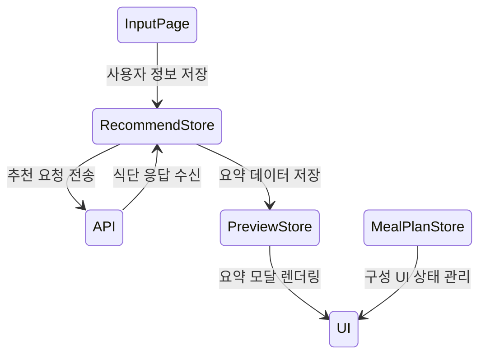

# Capstone-Design-Project 🚀  
**AI 기반 개인 맞춤형 식단 추천 웹서비스**

[](https://nodejs.org/)
[](#license)
[](#ci)

> **“누구나 건강하게 먹을 권리가 있다.”**  
> 영양학·예산·알레르기·식습관 데이터를 AI로 분석해  
> **맞춤 식단**과 **시각화된 영양 리포트**를 제공하는 올-인-원 웹앱

## 📸 데모 & 스크린샷

| 시스템 아키텍처 (프로젝트 개요) | 기능 플로우 (모듈 개요) |
|:--:|:--:|
|  |  |

<p align="center">
  <a href="https://your-demo-url.com" target="_blank">
    
  </a>
</p>

## 📝 소개 (Description)

현대인은 **개인 체형·건강 목표·시간·예산·알레르기** 등 다양한 제약 속에서 “뭘 먹어야 할지” 고민합니다.  
**Capstone-Design-Project**는 이러한 문제를 해결하기 위해 **AI 엔진**과 **풍부한 영양 DB**를 결합,  
사용자 맞춤 식단을 **원-클릭**으로 추천하고 시각화까지 제공하는 올-인-원 웹서비스입니다.

### 핵심 기능
| 카테고리 | 기능 |
|----------|------|
| **1. 데이터 입력** | 키 · 체중 · 목표(감량/증량) · 활동량 · 예산 · 알레르기 |
| **2. AI 식단 추천** | <br>• 칼로리 & 3대 영양소 밸런스 계산 <br>• 음식 가격 반영 예산 최적화 <br>• 대체 식단(Fallback) 제공 |
| **3. 구성/편집 UI** | 끌어-놓기(Drag-and-Drop)로 식단 수정, 실시간 영양 계산 |
| **4. 결과 시각화** | 게이지 차트·스택 바·파이 차트로 영양 비율을 직관적으로 표시 |
| **5. 저장 & 다운로드** | 식단 요약 TXT 다운로드 · DB 저장 · API 응답(JSON) 제공 |

### 주요 기술 키워드

| 영역 | 스택 |
|:--|:--|
| **Frontend** |      |
| **Backend** |     |
| **Dev&nbsp;Tools** |     |

## 📋 Table&nbsp;of&nbsp;Contents
- [소개 (Description)](#-소개-description)
- [데모 & 스크린샷](#-데모--스크린샷)
- [주요 기능](#-기능-features)        
- [주요 기술 스택](#-주요-기술-키워드)
- [Quick Start](#-quick-start)
- [NPM 스크립트](#-npm-스크립트)
- [폴더 구조](#-폴더-구조-folder-structure)
- [코드 스타일 & 개발 환경](#-코드-스타일--개발-환경)
- [프로젝트 아키텍처](#-프로젝트-아키텍처)
- [로드맵](#-로드맵-roadmap)
- [기여 방법](#-기여-방법-contributing)
- [License](#license)
- [Credits](#-참고-자료-acknowledgements)

---

## ⚡ Quick Start

> **Prerequisites**  
> - Node.js ≥ 18 / npm ≥ 9  
> - `.env` 파일: `cp .env.example .env` 후 값 입력

```bash
# 1) 레포지토리 클론
git clone https://github.com/donghun-dev1/Capstone-Design-Project.git
cd Capstone-Design-Project

# 2) 의존성 설치
npm install

# 3) 개발 서버 & 백엔드 동시 실행
npm run dev
```

## ✨ 기능 (Features)

| # | 기능 | 설명 |
|---|------|------|
| 1 | **AI 맞춤 식단 추천** | 성별·연령·활동량·알레르기·예산을 입력하면 <br>AI 엔진이 **칼로리·3대 영양소·가격** 균형을 맞춰 식단을 생성 |
| 2 | **Drag-and-Drop 식단 편집** | 카드 방식 UI로 끌어-놓기만 하면 식단 재구성<br>→ 실시간으로 영양·칼로리·비용 업데이트 |
| 3 | **영양 시각화 대시보드** | 게이지·스택 바·파이 차트로 <br>섭취 비율·권장량 대비 초과/부족 구간을 즉시 확인 |
| 4 | **예산 최적화 알고리즘** | 동일 칼로리 범위 내에서 **가성비 최상** 조합 제안 <br>– 할인/계절가 정보 반영 |
| 5 | **대체 식품 추천** | 특정 음식 제외 시 **알레르기·취향 필터** 기반 대체 메뉴 자동 제안 |
| 6 | **PDF · CSV · JSON 내보내기** | 결과 리포트를 한 번에 다운로드 → 의료진·PT 트레이너 공유 가능 |
| 7 | **PWA & 모바일 최적화** | 홈 화면 설치 지원, 오프라인 캐싱, 다크 모드 |
| 8 | **DevOps 친화 CI/CD** | GitHub Actions → Vercel Preview → 프로덕션 자동 배포 |

## 🛠 NPM 스크립트

| 명령어 | 설명 |
|--------|------|
| `dev` | 프런트 + 백엔드 **동시** 개발 서버 실행 |
| `build` | Vite 프런트 빌드 **+** esbuild 서버 번들 |
| `start` | 프로덕션 서버 실행 (`dist/index.js`) |
| `check` | `tsc`&nbsp;+&nbsp;`eslint`&nbsp;+&nbsp;`prettier` **통합 품질 검사** |
| `lint` / `lint:fix` | ESLint 검사 / 자동 고침 |
| `format` | Prettier로 코드 일괄 포맷 |
| `db:push` | Drizzle ORM 마이그레이션 반영 |
| `preview` | Vite 정적 결과 미리보기 |

<details>
<summary><code>package.json</code> 스크립트 원문 보기</summary>

```json
"scripts": {
  "dev": "cross-env NODE_ENV=development tsx server/index.ts",
  "build": "vite build && esbuild server/index.ts --platform=node --packages=external --bundle --format=esm --outdir=dist",
  "start": "NODE_ENV=production node dist/index.js",
  "check": "tsc && npm run lint && npm run format",
  "db:push": "drizzle-kit push",
  "lint": "eslint . --ext .ts,.tsx,.js",
  "lint:fix": "eslint . --ext .ts,.tsx,.js --fix",
  "format": "prettier . --write",
  "preview": "vite preview"
}
```
</details>

## 🗂️ 폴더 구조 (Folder Structure)

<details>
<summary>프로젝트 디렉터리 트리 보기</summary>

```text
Capstone-Design-Project/
├── samename/
│   ├── client/                    # React + TS 프론트엔드
│   │   ├── src/
│   │   │   ├── components/       # UI & Feature 컴포넌트
│   │   │   ├── pages/            # 라우트 페이지
│   │   │   ├── stores/           # Zustand 상태
│   │   │   ├── hooks/            # 커스텀 훅
│   │   │   ├── styles/           # Tailwind / CSS
│   │   │   └── main.tsx
│   │   └── index.html
│   ├── server/                   # Express API 서버
│   │   ├── routes.ts
│   │   ├── storage.ts            # DB 액세스 (Drizzle ORM)
│   │   ├── db.ts
│   │   └── index.ts
│   ├── shared/                   # 공용 타입 & 스키마
│   ├── drizzle.config.ts
│   ├── tailwind.config.ts
│   ├── eslint.config.js
│   ├── .prettierrc
│   └── .vscode/
│       ├── settings.json
│       └── extensions.json
├── .gitignore
├── README.md
└── package.json
```

</details>

## 🎨 코드 스타일 & 개발 환경

> 저장만 해도 **자동 포맷 + 실시간 에러 감지**  
> 팀원 누구나 동일한 환경에서 일관된 코드를 작성할 수 있도록 설정되었습니다.

### ✅ 적용된 도구

| 도구 | 역할 |
|------|------|
| **ESLint** | 코드 스타일·에러 실시간 감지 (FlatConfig 기반) |
| **Prettier** | 저장 시 자동 코드 정렬 |
| **VS Code 설정 공유** | `.vscode/settings.json` 및 확장 추천 제공 |
| **자동 실행** | 저장 시 ESLint + Prettier가 자동 작동함 (`formatOnSave`, `fixAll`) |

---

### 🔧 핵심 설정 파일

| 파일 경로 | 역할 |
|-----------|------|
| `eslint.config.js` | FlatConfig 기반 ESLint 룰 정의 |
| `.prettierrc` | Prettier 포맷 옵션 (탭 너비 등) |
| `.eslintignore` / `.prettierignore` | 린트·포맷 제외 디렉터리 |
| `.vscode/settings.json` | 저장 시 자동 포맷 + 린트 |
| `.vscode/extensions.json` | 팀원 공통 추천 확장 (ESLint, Prettier)

---

### 📦 필수 확장 (VS Code)

- ✅ [ESLint](https://marketplace.visualstudio.com/items?itemName=dbaeumer.vscode-eslint)  
- ✅ [Prettier – Code formatter](https://marketplace.visualstudio.com/items?itemName=esbenp.prettier-vscode)

---

### 📄 설정 스냅샷

<details>
<summary><code>.vscode/settings.json</code></summary>

```json
{
  "editor.formatOnSave": true,
  "editor.codeActionsOnSave": {
    "source.fixAll": true,
    "source.fixAll.eslint": true
  },
  "eslint.validate": ["javascript", "typescript", "typescriptreact"],
  "eslint.experimental.useFlatConfig": true
}
```

</details>

## 🔀 커밋 & 브랜치 규칙

> 팀 협업과 Git 기록 관리의 일관성을 위해  
> **Conventional Commits + 기능별 브랜치 전략**을 따릅니다.

---

### 🧩 브랜치 전략

| 브랜치명 | 설명 |
|----------|------|
| `main` | 운영/배포용 브랜치 (🔒 직접 커밋 금지) |
| `seil`, `dev`, `feat/login`, `fix/modal-crash` 등 | 기능별 작업 브랜치 (기여자는 여기서 작업 후 PR) |

> 브랜치는 소문자 + kebab-case 또는 feature 단위로 명확히 작성합니다.  
> 예: `feat/ai-recommend`, `fix/nutrient-calculation`, `refactor/store-structure`

---

### 📝 커밋 메시지 규칙 (Conventional Commits)

```
<타입>: <의미 있는 설명>
```

| 타입 | 목적 |
|------|------|
| `feat` | 새로운 기능 추가 |
| `fix` | 버그 수정 |
| `docs` | 문서 작성/수정 (README 등) |
| `style` | 코드 포맷팅, 세미콜론 누락 등 비즈니스 로직 변경 없는 수정 |
| `refactor` | 리팩토링 (기능 추가/수정 없이 구조 개선) |
| `test` | 테스트 코드 추가/수정 |
| `chore` | 설정, 빌드, 패키지 등 비즈니스 로직 외 변경 |

예시:
```bash
git commit -m "feat: AI 식단 추천 로직 초기 구현"
git commit -m "fix: drag-and-drop 오류 수정"
git commit -m "chore: ESLint + Prettier 설정 적용"
```

---

### ✅ PR 예시

```bash
git checkout -b feat/meal-config-editor
# 작업 후
git add .
git commit -m "feat: 식단 구성 페이지 drag-and-drop UI 추가"
git push origin feat/meal-config-editor
```

## 🧠 프로젝트 아키텍처

> 이 프로젝트는 **AI 식단 추천을 중심으로**, 사용자 입력 → 추천 생성 → 구성 편집 → 결과 시각화까지  
> **일관된 상태 흐름과 API 분리 구조**를 기반으로 동작합니다.

---

### 📍 시스템 구성도

| 전체 흐름 (중앙 AI 알고리즘 중심) |
|:--:|
|  |

---

### 📦 모듈 구조

| 주요 모듈 관계 |
|:--:|
|  |

---

### ⚙️ Zustand 상태 흐름



- `useUserInfoStore` → 사용자 입력 정보 전역 관리
- `useRecommendStore` → API 요청/응답 및 로딩/에러 상태 관리
- `usePreviewStore` → 요약 정보(칼로리/영양소) 전역 공유
- `useMealPlanStore` → 드래그&드롭 기반 식단 구성 저장소

---

### 🧬 DB 모델 (Drizzle ORM 기반)

- 유저 정보, 식단 구성, 음식 테이블, 추천 로그 등은 `.shared/schema.ts`에서 선언
- 마이그레이션은 `drizzle-kit push` 명령어로 자동 관리됨

```ts
// 예시: DietRecommendation 스키마 일부
export const dietRecommendations = pgTable("diet_recommendations", {
  id: serial("id").primaryKey(),
  userId: integer("user_id").references(() => users.id),
  meals: json("meals"),
  createdAt: timestamp("created_at").defaultNow(),
});
```

## 🗺️ 로드맵 (Roadmap)

> 향후 기능 확장 계획과 기술적 개선 항목입니다.  
> 완료된 항목은 ✅, 진행 중은 🔄, 예정은 ⏳ 으로 표시됩니다.

### ✅ v1.0 (현재 상태)

- [x] AI 기반 식단 추천 기능 (성별, 체중, 체지방률 등 반영)
- [x] 드래그&드롭 식단 구성 UI
- [x] 상태 관리 (Zustand 기반 전역 스토어)
- [x] 식단 요약 결과 모달 & 시각화 차트
- [x] PDF/JSON/CSV 내보내기 기능
- [x] ESLint + Prettier 기반 코드 스타일 자동화
- [x] Git 브랜치 & 커밋 규칙 정립

---

### ⏳ v1.1 (예정)

- [ ] GitHub Actions 기반 CI/CD (PR 자동 린트 + 포맷 검사)
- [ ] Husky `pre-commit` 훅 + `npm run check` 연결
- [ ] `.editorconfig` 도입 (IDE 간 코드 호환성 유지)
- [ ] Zustand 상태 자동 persist 기능 도입
- [ ] 대체 식품 추천 정확도 개선 (사용자 피드백 기반 학습)

---

### 🧪 v2.0 (후속 개발 고려 사항)

- [ ] AI 식단 추천 정확도 고도화 (데이터셋 다변화)
- [ ] 사용자 추천 히스토리 기반 피드백 학습 알고리즘 도입
- [ ] React Query 도입 + Suspense 연동
- [ ] OAuth 소셜 로그인 (Google, Kakao) → ✅ **현재 구현 제외됨**
- [ ] 완전한 모바일 퍼스트 대응 + 반응형 UI 최적화


